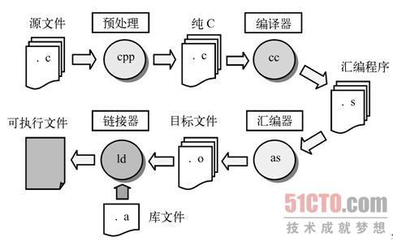

#基本概念
##目录
## 2.1 环境
#### 2.1.1 翻译
#### 2.1.2 执行
## 2.2 词法规则
#### 2.2.1 字符
#### 2.2.2 注释
#### 2.2.3 自由形式的源代码
#### 2.2.4 标识符 
#### 2.2.5 程序的形式
## 2.3 程序风格
## 2.4 总结

## 2.1 环境
1.环境分为两种：**翻译环境**和**执行环境**
####翻译环境 ：将源代码转换为可执行的机器指令
对应于常见ide的编译，编译之后会生成二进制的可执行指令。
#### 执行环境 ：用于实际执行代码 
>注意：
>1、ANSI(美国国家标准学会) 标准明确说明，这两种环境可以不在同一台机器上.
>> 举个简单的例子，51单片机的源代码在kill里面写，写完之后，由kill按照51的C语言语法编译成相关的二进制指令。再通过烧录软件烧录到51单片机上，那么代码的执行环境就是在51单片机上 ，而编译环境在电脑上。同样的还有其他的单片机。

>2、交叉编译器产生的代码可以在不同类型的机器上。
>>简单地说，就是在一个平台上生成另一个平台上的可执行代码。同一个体系结构可以运行不同的操作系统；同样，同一个操作系统也可以在不同的体系结构上运行。
举例来说，我们常说的x86 Linux平台实际上是Intel x86体系结构和Linux for x86操作系统的统称；而x86 WinNT平台实际上是Intel x86体系结构和Windows NT for x86操作系统的简称。芯片的架构和操作系统是息息相关的。
也就是说如果我在linux上用gcc编译之后产生的可执行文件只能在linux上面跑（把这个文件拷到另外一个系统上也能运行，如果我是用的另一种芯片架构、但是操作系统相同的机器呢？我觉得应该不行了）交叉编译应该可以解决一次编译，所有平台运行的效果。

**星期四, 25. 四月 2019 03:56下午 **
####2.1.1 翻译
翻译的基本流程是源代码经过编译器编译生成目标代码。 链接器将目标编码和库文件（一般为.a或者.so文件）转换为可执行文件。
#####*编译的几个阶段*
- **预处理 **：  输入为 .c 文件输出为   .i 文件 （.i 文件为将头文件包含进来、和宏定义）命令：**gcc –E hello.c –o hello.i **
    + 1、 **预处理器**在源代码上执行一些***文本操作***。比如用实际值代替由#define定义 指令命令的符号，读入由#include包含的的文件的内容。
  在include语句中，“<>”表示在标准路径中搜索头文件，““””表示在本目录中搜索
  【*原来ifndef的作用时期是在编译的第一阶段，有很多时候找不到头文件也是这个时候会报的一些错误,在编写头文件的时候最好还是能吧ifndf加上，不知道其他的语言是怎么解决这个问题的。比如python 的import ,加入我导入了相同的包 取了不一样的别名 或者一样的别名，又会发生什么？？*】
+  **解析**  输入为 .i  文件 输出为 汇编文件 命令：gcc –S hello.i –o hello.s（PS ： 此处的输入输出仅仅是根据后面的命令来写的，具体的输入输出要看自己的命令和要求 一般情况下都是直接从 .c 文件 输出为 .o 文件 或者 干脆点就是.out 文件 命令不同 输入输出就不同 但是 gcc在这个时间段 干的事情就不会变 区别就在于这件事情干了多少 一个程度的问题）
     +    解析阶段是多数错误和警告出现的地方。
     +  在这个阶段中，Gcc首先要检查代码的规范性、是否有语法错误等，以确定代码的实际要做的工作，在检查无误后，Gcc把代码翻译成汇编语言。用户可以使用”-S”选项来进行查看，该选项仅编译到汇编语言，不进行汇编和链接，生成汇编代码。gcc检查除了多少错误还是要看gcc 是按照什么标准来解释代码的  官方的标准就有 GNIC IEEE 。。。等等
**     编译结束**  PS： 目标文件是直接产生的还是先生成汇编文件 再由汇编生成二进制的目标文件 .so 或者 .a 文件 也不是那么的重要。还有就是在生成目标文件的过程中的优化阶段就是debug个realse的区别 如果在 -o 后面加入了优化的选项 那么优化器就会上场了，优化器会对代码进行进一步的处理。使得代码的效率更高。下面是引用简书的一句话。
>  *不同的优化级别对应不同的优化处理工作。如使用优化选项“-O”主要进行线程跳转(Thread Jump)和延迟退栈(Deferred Stack Pops)两种优化。
使用优化选项“-O2”除了完成所有“-O1”级别的优化之外，同时还要进行一些额外的调整工作，如处理器指令调度等。
选项“-O3”则还包括循环展开和其他一些与处理器特性相关的优化工作。
虽然优化选项可以加速代码的运行速度，但对于调试而言将是一个很大的挑战。因为代码在经过优化之后，原先在源程序中声明和使用的变量很可能不再使用，控制流也可能会突然跳转到意外的地方，循环语句也有可能因为循环展开而变得到处都有，所有这些对调试来讲都将是一场噩梦。
所以笔者建议在调试的时候最好不使用任何优化选项，只有当程序在最终发行的时候才考虑对其进行优化。*

引用：[gcc编译详解](https://www.cnblogs.com/DswCnblog/p/5825292.html) 
 
#### 文件名
 C语言的标准并没有制定文件的取名规则（？？那岂不是是个文件都能包含进来 不过编译也会出错，，，） 但是大多数的环境都存在必须遵守的规定 （看来操作系统才是真正的老大 ）

后缀名|意义|备注
--|:--:|--:
.c| c 语言源文件| 无
.h| 头文件| 如果是系统目录下面 的头文件 一般放在/usr/include/ 下面的文件 被编译器认为是标准头文件 在引用的时候是通过<>来引用的   相反的是“”引用的头文件 一般是在当前目录下面的文件   这时候要引入不在当前目录下的头文件 常见的有opencv 的头文件引用   一般是将opencv的安装目录的路径引用到程序下   那样的话opencv的文件目录就和当前程序的文件“拼在了一起“   引用起来就像是在当前目录下面一样 在cmake里面经常 用findpackage  或者 findproject来干这个活
.obj|windows平台的目标文件|MS-DOS命令行

